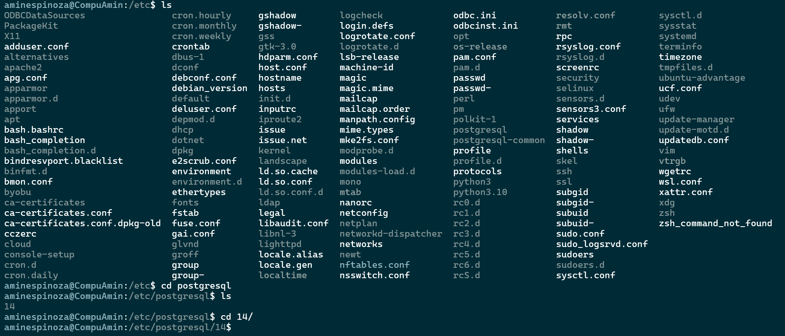

# Proceso de instalación en Ubuntu

Para instalar PostgreSQL solo debes escribir el comando

```bash
sudo apt instal postgresql
```

Después de eso debes moverte a la ubicación

```bash
/etc
```

En donde encontrarás la carpeta donde todo se instaló y ahí podrás ver la versión que hayas instalado.



Ya que te encuentres ahí, entonces ubica una carpeta llamada **main**. En esta carpeta debes ver lo siguiente.


Actualiza el archivo **postgresql.conf** con lo siguiente:

```bash
listen_addresses = '*'
```

Escribe el comando 

```bash
sudo -u postgres psql template1
```

Escribe la consulta:

```sql
ALTER USER postgres with encrypted password 'Pl1tz3_r5l2s'
```

Ahora abre el archivo **pg_hba.conf**. Modifica lo siguiente.

```bash
hostssl template1       postgres        172.29.32.255/24        scram-sha-256
host    all             postgres        0.0.0.0/0               scram-sha-256
```

Recuerda reiniciar tu servicio de PostgreSQL.

```bash
sudo systemctl restart postgresql.service
```

Confirma que tu servicio esté funcionando.

```bash
sudo service postgresql status
```

Ahora instala el cliente para PostgreSQL.

```bash
sudo apt install postgresql-client
```

¡Buena suerte con tu configuración!